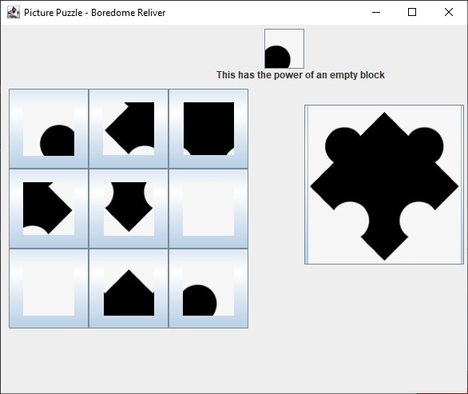

# Boredom-Reliever

A Collection of Games and Utilities💣 built using Java-Swing Framework😎 following the Model View Controller Architecture🧱 and implements **Object-Oriented Programming** .

Included Games:

- Tic Tac Toe
- Picture Puzzle
- Number Puzzle

Utilities:

- Notepad
- Calculator

Screenshots:

- App
  

- Tic Tac Toe

  
  
- Picture Puzzle

  
  
- Number Puzzle

  
- Notepad

  
- Calculator

  

Implementation of **OOPS**:
- Abstraction:
  We used classes and objects for implementing essential features
  
  
- Encapsulation:
  Usage of private access modifiers in variables and methods
  
- Polymorphism:
  Creating helper methods in a common java file for them to be reusable
  
